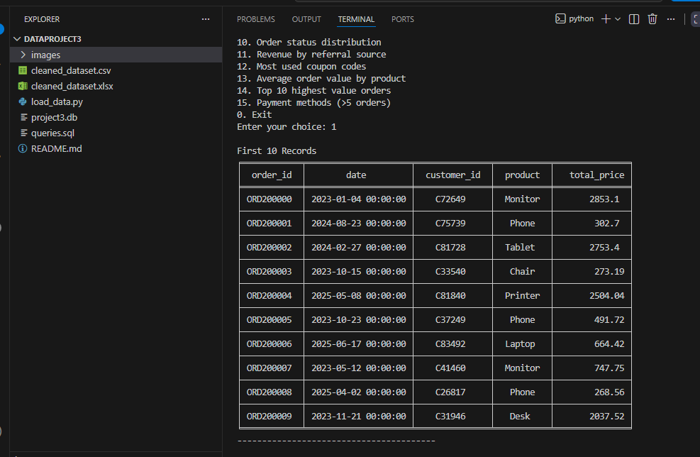
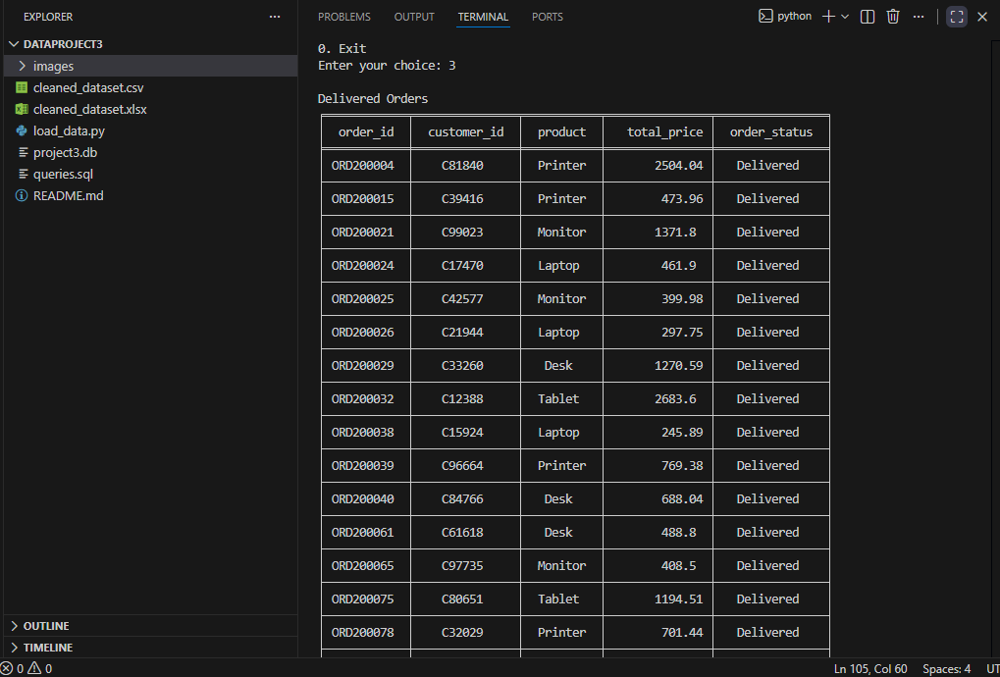
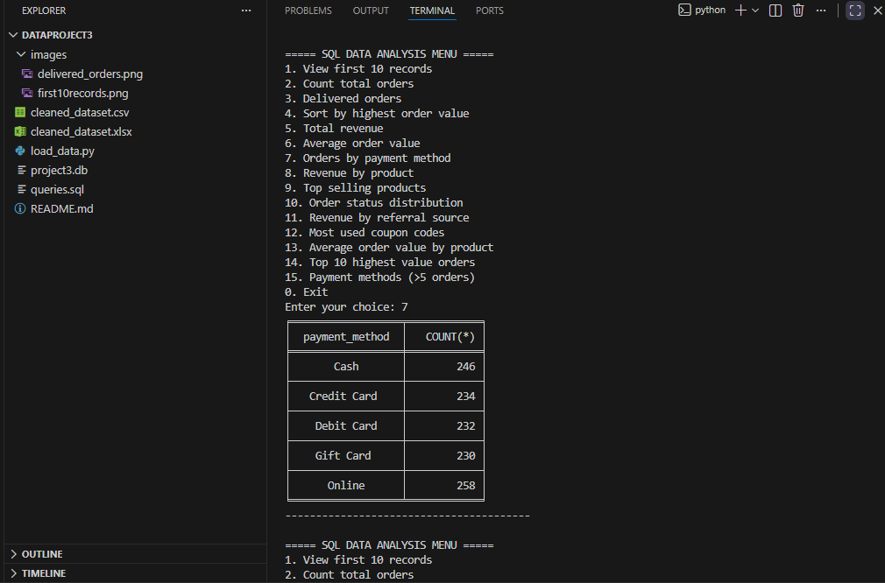
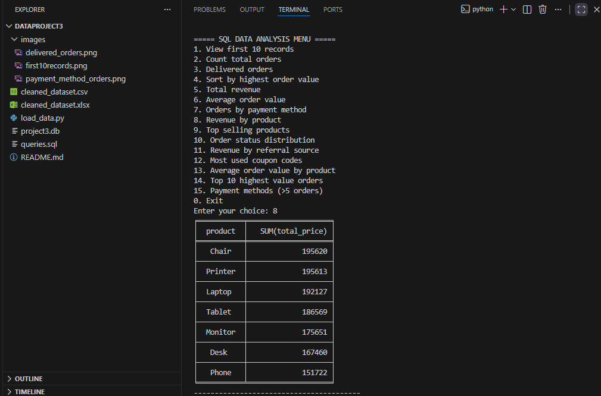
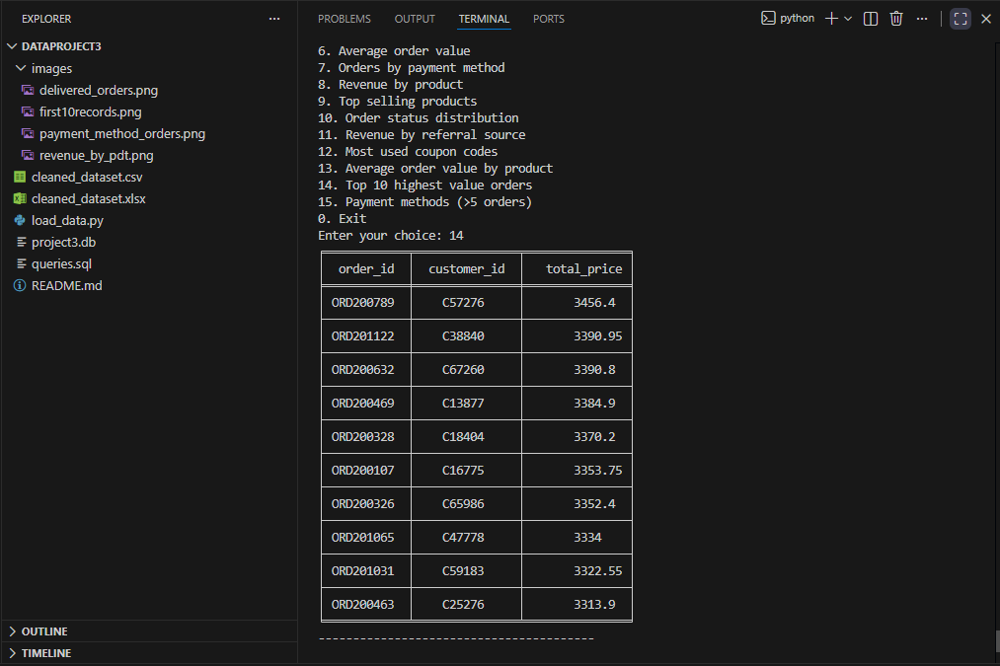

# DecodeLabs- Data Analytics Internship,Task-3

# 📊 Project 3: SQL Data Analysis 

## 📌 Project Overview
This project demonstrates data analysis using SQL queries integrated with Python. A real-world structured dataset is loaded from a CSV file into an SQLite database, and various SQL queries are executed to extract meaningful business insights such as revenue analysis, order trends, customer behavior, and product performance.

A menu-driven interface allows users to interactively run SQL queries and view results directly in the terminal.

---

## 🎯 Objectives
- Load dataset from CSV into SQLite database
- Perform SQL-based data analysis using Python
- Apply filtering, sorting, grouping, and aggregation operations
- Extract insights such as revenue, top products, and order patterns
- Build an interactive menu-driven query system

---

## 🛠️ Technologies Used
- Python 3.x
- SQLite3
- Pandas
- Tabulate
- CSV Dataset (`cleaned_dataset.csv`)

---
```
## 📂 Project Structure
DataProject3/
│
├── load_data.py
├── project3.db
├── cleaned_dataset.csv
├── cleaned_dataset.xlsx
├── queries.sql
├── README.md
│
└── images/
    ├── first_10_records.png
    ├── delivered_orders.png
    ├── payment_method.png
    ├── revenue_by_product.png
    └── top10_orders.png
```
---

## ⚙️ Project Workflow

### 1. Data Loading
- CSV file is loaded using Pandas
- Data is stored into SQLite database (`project3.db`)
- Table name used: `orders`

### 2. Database Creation
- SQLite database is created automatically if not exists
- Data is inserted into the `orders` table using `to_sql()`

### 3. SQL Analysis
- SQL queries are executed using Python cursor
- Results are fetched and displayed in formatted tables using `tabulate`

### 4. Interactive Menu System
- User selects options (1–15)
- Each option executes a specific SQL query
- Output is displayed in terminal

---

## 📊 Key Features / Queries

✔ View first 10 records  
✔ Count total orders  
✔ Filter delivered orders  
✔ Sort orders by highest value  
✔ Calculate total revenue  
✔ Calculate average order value  
✔ Orders by payment method  
✔ Revenue by product  
✔ Top selling products  
✔ Order status distribution  
✔ Revenue by referral source  
✔ Most used coupon codes  
✔ Average order value by product  
✔ Top 10 highest value orders  
✔ Payment methods with more than 5 orders  

---

## 🧠 SQL Concepts Used

- SELECT statements  
- WHERE filtering  
- ORDER BY sorting  
- GROUP BY aggregation  
- HAVING clause  
- Aggregate functions (COUNT, SUM, AVG)

---

## ▶️ How to Run the Project

### Step 1: Install dependencies
```bash
pip install pandas tabulate
```

### Step 2: Run the program
```bash
python load_data.py
```
## 📸 Screenshots

### 1. First 10 Records


### 2. Delivered Orders


### 3. Orders by Payment Method


### 4. Revenue by Product


### 5. Top 10 Highest Orders


##  Author
- Name: Drisya M  
- Course: B.Tech CSE  
- Institution: Royal College of Engineering and Technology,Thrissur
